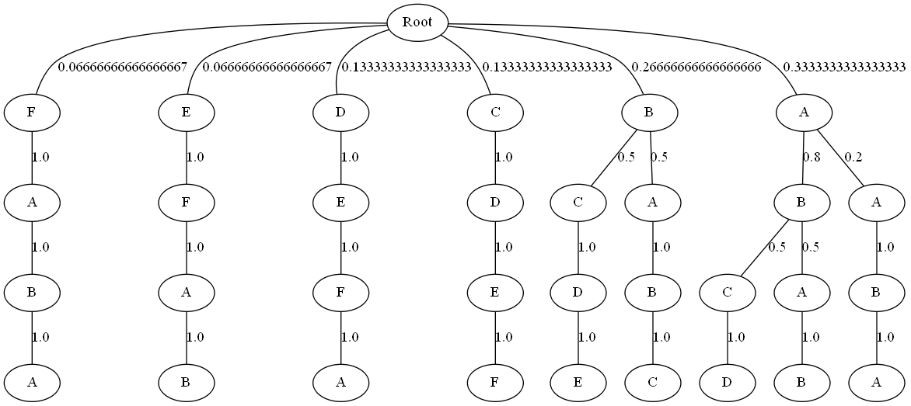

# Outlier-PST

Generates a probabilistic suffix tree based on the given sequential data. The generated tree can be used to detect outliers.


<h3> Train </h3>

To fit the model, run the following command.
```python
python main.py --dataset AEP_hourly.csv
```

`main.py` also takes the following optional arguments
```
--dir       Dataset directory
--size      Length of buffer
--k         No. of clusters
```

<h3> Sample Output </h3>


